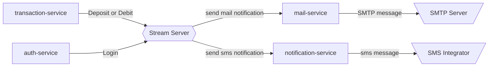

# Desafío de código Semi-Senior
Nuestro desafío te permitirá mostrarnos tus habilidades de codificación!!. También, es importante que te sientas a gusto con las tecnologías con las que debes desarrollar el desafío y no olvides que, **"tener un código correctamente estructurado y documentado habla bien de ti como desarrollador :blush:".**

***Mucha suerte!! :muscle:***

## Antes de desarrollar 
1. Para iniciar con tu desafío debes crear un **Fork** del repositorio.
2. Si ya finalizaste tu desarrollo, debes enviar un **Pull Request** con tu solución al repositorio principal.
3. Cada **commit message** que realices debe ser descriptivo y relacionado al desarrollo que has realizado.

## Problema

Al finalizar una transacción bancaria, es importante notificar a los usuarios sobre los movimientos realizados en sus cuentas como por ejemplo los depósitos o retiros. Además, para los usuarios también es importante recibir notificaciones de sus inicios de sesión para validar que ellos son los que están accediendo.

### Tipos de notificaciones
1. Transacciones
2. Inicio de sesión
3. Códigos de seguridad

## Reto

Se debe desarrollar una solución que permita recibir mensajes por un servidor mediante streaming y que dependiendo del tipo de mensaje se envíen las notificaciones respectivas.

### Indicaciones
- Las clases y atributos a crear son a criterio del candidato evaluado, únicamente colocar los atributos que considere mas importantes teniendo como máximo 5 atributos por clase.
- La informacion debe ser almacenada en una base de datos ( puede utilizar la bdd que desee).
- Realizar las pruebas (unitarias, integración) que considere necesarias.
- Aplicar las practicas, patrones, estándares, etc que considere.
- Se debe gestionar diferentes canales de comunicación de mensajes por streaming.

### Servicios requeridos
- ***transaction-service:*** Este servicio debe suscribirse al servidor de streaming y publicar eventos cada 5 segundos simulando transacciones.
- ***auth-service:*** Este servicio debe suscribirse al servidor de streaming y publicar eventos cada 8 segundos simulando inicios de sesión.
- ***mail-service:*** Este servicio se encarga de almacenar las plantillas de los correos electrónicos a enviar como notificaciones y permite reemplazar información en las plantillas antes de ser enviadas. Además, permite conectase a un servidor SMTP para el envío de correos electrónicos.
- ***notification-service:*** Este servicio se encargar de almacenar las plantillas de mensajes a enviar por SMS y WhatsApp. También permite reemplazar información antes de enviar las notificaciones.

### Funcionalidades
1. CRUD de templates para email.
2. CRUD de templates para sms y WhatsApp.

## Tecnologías
1. NodeJS v18+
2. NestJS Framework
3. TypeORM
4. Npm - Yarn - Pnpm
5. Swagger
6. Kafka
7. Docker
8. docker-compose